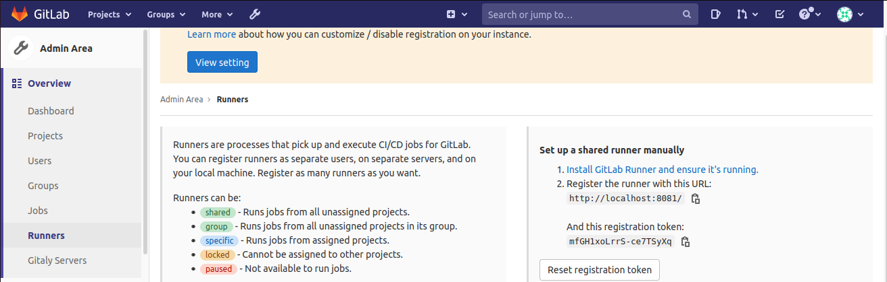

# docker-compose com um gitlab + gitlab-ci com o registry embutido e um runner docker

## Dependencias

 1. docker (testado na versão 20.10.5)
 2. docker-compose (testado na versão 1.25)
 * Fui testado usando o SO Ubuntu 20.04

## Registrando o runner
```bash
# na pasta contendo o docker-compose.yml e a pasta conf
docker run -it --network docker-compose-gitlab-ci_default -v `pwd`/conf/runner:/etc/gitlab-runner gitlab/gitlab-runner register \
  --non-interactive \
  --executor "docker" \
  --docker-image alpine:latest \
  --url "http://gitlab/" \
  --registration-token "PROJECT_REGISTRATION_TOKEN" \
  --description "compose-runner-1" \
  --tag-list "docker"
# é preciso trocar o "PROJECT_REGISTRATION_TOKEN" pelo token obtido na aba de runners do gitlab Ex. http://localhost:8081/admin/runners
```
Tela para obter o token para registro do runner
  
Se estiver rodando sem nenhuma alteração das portas no docker-compose.yml, deve ser acessivel em:  
[http://localhost:8081/admin/runners](http://localhost:8081/admin/runners)


### Config pós register do runner
#### Alterando o arquivo de config do runner
O arquivo deve estar em conf/runner/config.toml
E após o registro não deve estar com permissão para editar com usuário que não seja root ou o dono (que vai ser um utilizado pela imagem). Então ou se edita como sudo ou pode se alterar o owner para o seu usuário.
```toml
# vai ser o arquivo que vai ficar no diretorio conf/rrunner/config.toml

[[runners]]
  name = "compose-runner-1"
  url = "http://gitlab/"
  token = "TOKEN_GERADO_PELO_GITLAB"
  executor = "docker"
  [runners.custom_build_dir]
  [runners.cache]
    [runners.cache.s3]
    [runners.cache.gcs]
    [runners.cache.azure]
  [runners.docker]
    tls_verify = false
    network_mode = "host" #para funcionar nos containers que vão rodar dentro do dind, vai usar a rede do container dind e não bridge, que iria seria separado do docker-compose
    image = "alpine"
    privileged = false
    disable_entrypoint_overwrite = false
    oom_kill_disable = false
    disable_cache = false
    volumes = ["/cache"]
    shm_size = 0
```
Após essa alteração o runner deve ler carregar as novas configurações.